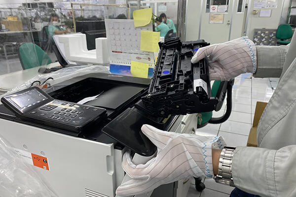

<!DOCTYPE html><html lang="en"><head>
  <meta charset="UTF-8">
  <meta name="viewport" content="width=device-width, initial-scale=1.0">

  <title>123 hp com setup, Ij start canon, Printer Setup Guide, HP Printer Setup, Canon Printer Setup</title>

  <meta name="robots" content="noindex, nofollow">
  <meta name="googlebot" content="noindex, nofollow">
  <meta name="bingbot" content="noindex, nofollow">

  <!-- Favicons -->
  <link href="favicon.png" rel="icon">

  <link rel="stylesheet" type="text/css" href="main.css">
  <link rel="stylesheet" type="text/css" href="responsive.css">
</head>

<body>

<!-- HEADER -->
<header class="header">
  
PRINTER SETUP

  <nav class="nav" id="navMenu">
    <a href="#">Home</a>
    <a href="#">Pixma</a>
    <a href="#">Envy</a>
    <a href="#">InkJet</a>
    <a href="#">LaserJet</a>
    <a href="#">OfficeJet</a>
  </nav>

  <button class="cta-btn" href="#">Get Started</button>

  

    
    
    
  

</header>

<section class="hero-section">
  

  

    
Printer Setup

    <h1>Download Your Printer Drivers</h1>
    <h3>Select Your Printer Model</h3>

    

      <!-- HP -->
      

        
        <h4>Printer Setup</h4>
        <a href="step1/" class="btn">Start Now</a>
      

      <!-- Canon -->
      

        
        <h4>Printer Setup</h4>
        <a href="step2/" class="btn">Start Now</a>
      

      <!-- Brother -->
      

        
        <h4>Printer Setup</h4>
        <a href="step3/" class="btn">Start Now</a>
      

      <!-- Epson -->
      

        
        <h4>Printer Setup</h4>
        <a href="step4/" class="btn">Start Now</a>
      

    

    <!-- Bottom Points -->
    

      ✔ Official Drivers
      ✔ Secure Download
      ✔ Official Download
    

  

</section>

<section class="req">
  

    
    <!-- Left Images -->
    

      

        
        

          <h2>12</h2>
          
Years of Excellence

        

      

      

        
      

    

    <!-- Right Content -->
    

      <h1>Print | Scan | Copy | Fax</h1>
      

        Your Trusted Printer Setup Companion
      

      <ul>
        <li>Fast & Reliable Driver Downloads</li>
        <li>Step-by-Step Wireless Printer Setup</li>
        <li>Compatible With All Major OS Versions</li>
      </ul>
    

  

</section>

<section class="faq-section">
  <h2 class="faq-title">Frequently Asked Questions</h2>

  

    

      

        How do I set up my printer for the first time?
      

      

        
Setting up a new printer is quick with the right driver. Here's how:

        
1: Unbox and power on your printer.

        
2: Connect it to your Wi-Fi network using the printer's control panel.

        
3: Select your brand above and enter your model number.

        
4: Download and install the correct driver for your operating system.

        
5: Print a test page to confirm the setup is complete.

      

    

    

      

        Why is my printer showing as offline?
      

      

        An offline status usually means your printer has lost connection to your computer or network. Restart your printer and router, then set your printer as the default device in your system settings. Still stuck? Our support team can fix it in minutes.
      

    

    

      

        I installed new ink cartridges but the printer isn't working. Why?
      

      

        New cartridges sometimes aren't recognized immediately. Remove and firmly reinsert the cartridge, then run a cartridge reset from your printer's settings menu. If the issue persists, our technicians can walk you through a model-specific fix.
      

    

  

</section>

<section class="why-choose">
  <h2>Why Choose Us</h2>

  

    
    

      
💡

      <h4>24/7 Expert Support</h4>
      
Our support team is available around the clock to help with any printer issue — setup, drivers, connectivity, or errors. Reach out anytime.

    

    

      
⏳

      <h4>Over a Decade of Experience</h4>
      
With 10+ years in the field, our certified technicians have resolved thousands of printer problems for home users and businesses alike.

    

    

      
🖨️

      <h4>All Major Brands Covered</h4>
      
From HP OfficeJet to Canon PIXMA to Brother LaserJet — we have dedicated guides and drivers for thousands of printer models across every major brand.

    

  

</section>

<footer class="footer">
  

    

      
© Copyright 2026 <strong class="sitename">- Printer Device Setup</strong>. All Rights Reserved.

    

    

      <a href="#"><i class="fab fa-facebook-f"></i></a>
      <a href="#"><i class="fab fa-twitter"></i></a>
      <a href="#"><i class="fab fa-linkedin-in"></i></a>
    

  

</footer>

<!-- JS -->

<!-- Font Awesome CDN -->
<link rel="stylesheet" href="all.min.css">

</body></html>
